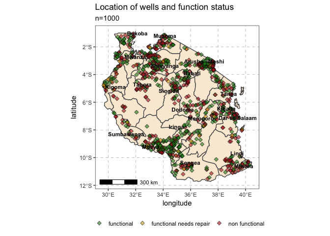
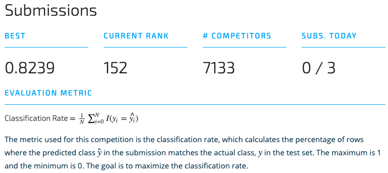

```{r setup, include=FALSE}
knitr::opts_chunk$set(
  echo = TRUE,
  collapse = TRUE,
  comment = "#>",
  out.width = "100%"
  )
options(width = 125)

library(tidyverse)
library(caret)
library(ggrepel)
library(ggspatial)
library(lubridate)
library(rnaturalearth)
library(recipes)
library(rvest)
library(skimr)
library(here)
```

## Predicting waterpump functionality in Tanzania
With its mission of social impact, [DrivenData](https://www.drivendata.org/#) puts an laudable spin on data science competitions. Of course, coming from the public sector and world of global health, I did not have to muster much motivation to try my hand at one of their competitions. So, I chose to enter the [Pump It up: Data Mining the Water Table](https://www.drivendata.org/competitions/7/pump-it-up-data-mining-the-water-table/) competition that involves a multiclass classification problem to predict water pump functionality in Tanzania.

```{r map-wells, eval=FALSE, echo=FALSE}
wells <- train_dta %>% 
  left_join(train_labs, by = "id") %>% 
  filter(type == "train",
         longitude > 0) %>%  # 100s of watrpoints in Atlantic Ocean // addressed in preprocessing
  select(id, region, latitude, longitude, status_group) %>% 
  sample_n(1000)

tza_base <- ne_states(iso_a2 = "TZ", returnclass = "sf")

ggplot() + 
  geom_sf(data = tza_base, fill = "antiquewhite") + 
  geom_jitter(data = wells, aes(x = longitude, y = latitude, fill = status_group), 
              size = 1.5, shape = 23, alpha = 0.6) + 
  geom_text_repel(data = select(region_refs, reg_capital, cap_lat, cap_lon),
                  aes(x = cap_lon, y = cap_lat, label = reg_capital),
                  size = 3, color = "black", fontface = "bold", min.segment.length = 0) + 
  scale_fill_manual(name = "", values = c("forestgreen", "goldenrod", "firebrick")) + 
  annotation_scale(location = "bl") + 
  theme_bw() + 
  theme(panel.grid.major = element_line(color = gray(0.5), linetype = "dashed", size = 0.5),
        legend.position = "bottom") + 
  labs(title = "Location of wells and function status", 
       subtitle = str_c("n=", nrow(wells)), 
       x = "longitude", y = "latitude")
```
<center>

</center>

As a side note, I found that Max Kuhn's [Feature Engineering and Selection](https://bookdown.org/max/FES/) to be very instructive and an excellent resource for exploring and implementing feature engineering methods.

### I. Preprocessing and feature engineering
As we will see shortly, this dataset is filled with lots of missing data, sparse factor levels, and imbalanced classes. In order to address issues like these, we need to survey the dataset then take systematic steps to preprocess some features (e.g. imputation; scaling and centering; transformations; encoding factors), drop features, or create new features altogether.

#### Inspect training and test sets
To start, let's load the provided datasets and assess the landscape using the excellent [{skimr}](https://ropensci.github.io/skimr/) package that prints a diagnostic of a given dataframe that includes summary statistics, degree of missingness, unique values, and even mini histograms!

```{r load-data, include=FALSE}
train_labs <- read_csv(here("data","training-set_labels.csv")) %>% mutate(status_group = factor(status_group))
train_dta  <- read_csv(here("data","training-set_values.csv")) %>% mutate(type = "train")
```

```{r skim-data, message=FALSE, out.width="100%"}
skim(train_dta)
```

Alright, now we have a sense of the data and we can start sorting out what kind of preprocessing and feature engineering might be warranted. So, let's inspect the categorical variables to start: we see that there are sets of very similar variables, e.g. `extraction_type`, `extraction_type_class`, and `extraction_type_group`. As you see below, the `extraction` variables provide finer degrees of specification moving from `*_class` to `*_type`. Retaining slight variations of the same feature may adversely affect the model's performance so we could consider recoding or collapsing the factor levels and dropping related variables altogether.

```{r}
train_dta %>% 
  select_at(vars(starts_with("extraction"))) %>% 
  map(unique)
```

Additionally, we can see from the `skim` that there are a handful of categorical variables with thousands of unique values, which may make sense for `subvillage` or `wpt_name` but likely not so useful for `funder` or `installer` where we can better combine categories - we will deal with those variables shortly. 

```{r, warning=FALSE}
train_dta %>% 
  select(funder, installer) %>% 
  map(~count(data.frame(x = .x), x) %>% arrange(desc(n)))
```

We also see there are quite a few variables with non-trivial amounts of missing data (`scheme_name`, `permit`, `public meeting`) and more importantly there are several variables with a proliferation of `0` values where they were likely used instead of `NA`. To address this issue, we will convert the `0`s to `NA`s and treat those `NA` values as an explicit `unknown` factor level. 

Lastly, there are nonsensical coordinates concentrated in the `Shinyanga` and `Mwanza` regions, so we plant a flag there to address through imputation later on. These waterpoint coordinates in the Atlantic Ocean only came to my attention when creating the map seen above. Yet another instance of "always visualize your data!"

```{r}
train_dta %>% 
  count(region, latitude, longitude) %>% 
  arrange(desc(n))
```

#### Creating features from external data sources
Now that we have identified areas for preprocessing, we should start thinking of new features that can complement the existing features and hopefully lend more information to the model. 

It seems reasonable that the physical remoteness of a waterpoint would be predictive so why don't we try engineer some features to that end. In particular, a well's proximity to the next largest city could provide a good proxy for accessibility and likelihood of maintenance. In order to do this, we grab each regional capital's coordinates and subsequently use `geosphere::distGeo()` to calculate the distance between the regional capital and the waterpoint as well as `recipes::step_geodist()` to calculate the waterpoint's absolute distance and from Dar es Salaam.

```{r grab-regional, eval=FALSE, message=FALSE}
## grab names of Tanzania's regional capitals
region_caps <- "https://en.wikipedia.org/wiki/Regions_of_Tanzania" %>% 
  read_html() %>%
  html_nodes(xpath = '//*[@id="mw-content-text"]/div/table') %>%
  html_table() %>% 
  as.data.frame() %>% 
  janitor::clean_names() %>% 
  mutate(capital = str_replace(capital, "\\-", " ") %>% str_remove("\\sCity"),
         region = str_remove_all(region, "\\sRegion")) %>% 
  select(region, reg_capital = capital)

## grab regional capital coordinates [https://simplemaps.com/data/world-cities] and join to names
region_refs <- read_csv(here("data", "worldcities.csv")) %>% 
  filter(iso3 == "TZA", capital %in% c("admin","primary")) %>% 
  mutate(capital = str_remove_all(capital, "city")) %>% 
  select(reg_capital = city, cap_lat = lat, cap_lon = lng) %>% 
  right_join(region_caps, by = "reg_capital")
```

#### Cleaning, preprocessing, feature engineering and selection
The below code documents the various processes undertaken to prepare the input data. These steps include: imputing missing data; string manipulation; addressing `NA` values; harmonizing class types; encoding categorical variables; creating new features; and, dropping redundant variables.

```{r preprocess, eval=FALSE}
prep_df <- bind_rows(train_dta, submit_dta) %>% 
  # join regional capitals dataframe
  left_join(region_refs, by = "region") %>% 
  # calculate mean lat-lon per district, region, and basin
  group_by(region_code, district_code) %>%
  mutate(dist_lon = mean(longitude, na.rm = TRUE),
         dist_lat = mean(latitude, na.rm = TRUE),
         dist_gps = mean(gps_height, na.rm = TRUE)) %>% 
  ungroup() %>% 
  group_by(region) %>% 
  mutate(reg_lon = mean(longitude, na.rm = TRUE),
         reg_lat = mean(latitude, na.rm = TRUE),
         reg_gps = mean(gps_height, na.rm = TRUE)) %>%
  ungroup() %>% 
  mutate(basin_lon = mean(longitude, na.rm = TRUE),
         basin_lat = mean(latitude, na.rm = TRUE),
         basin_gps = mean(gps_height, na.rm = TRUE)) %>%
  ungroup() %>% 
  # impute district-level mean lat-lons where value are nonsensical
  mutate(
    longitude = case_when(
      longitude == 0 & dist_lon != 0 ~ dist_lon,
      longitude == 0 & reg_lon != 0 ~ reg_lon,
      TRUE ~ longitude
      ),
    latitude = case_when(
      latitude == -0.00000002 & dist_lat != -0.00000002 ~ dist_lat,
      latitude == -0.00000002 & reg_lat != -0.00000002 ~ reg_lat,
      TRUE ~ latitude
      ),
    gps_height = case_when(
      gps_height == 0 & dist_gps != 0 ~ dist_gps,
      gps_height == 0 & reg_gps != 0 ~ reg_gps,
      gps_height == 0 & basin_gps != 0 ~ basin_gps,
      TRUE ~ gps_height
      )
    ) %>% 
  # clean up variable types, factor levels, deal with missingness
  mutate_if(is.character, ~str_to_lower(.) %>% str_squish(.)) %>%  # harmonize case and whitespace
  mutate_at(vars(-id, -source), ~na_if(., 0)) %>%                  # 0 ==> <NA>
  mutate_if(is.character, as.factor) %>%                           # convert <chr> to <fct>
  mutate_if(is.factor, fct_explicit_na, na_level = "unknown") %>%  # make <NA> explicit level
  mutate(extraction_type = recode(extraction_type,
                                  "cemo" = "other motorpump",
                                  "climax" = "other motorpump",
                                  "other - mkulima/shinyanga" = "other handpump",
                                  "other - play pump" = "other handpump",
                                  "walimi" = "other handpump",
                                  "other - swn 81" = "swn",
                                  "swn 80" = "swn",
                                  "india mark ii" = "india mark",
                                  "india mark iii" = "india mark"),
         # retain top 50 most frequent levels and lump remainder into "other"
         funder_cat = fct_infreq(funder) %>% fct_lump(n = 50, other_level = "other"),
         installer_cat = fct_infreq(istaller) %>% fct_lump(n = 50, other_level = "other"),
         # encode date variables
         date_recorded = ymd(date_recorded),
         weekend = if_else(wday(date_recorded) %in% c(1, 7), 0, 1),
         days_abs = as.numeric(as_date("2014-01-01") - date_recorded),
         day_of_year = yday(date_recorded),
         month_recorded = month(date_recorded),
         # create feature for rainy/dry seasons
         season = case_when(
           month_recorded %in% 1:2 ~ "dry_short",
           month_recorded %in% 3:5 ~ "wet_long",
           month_recorded %in% 6:10 ~ "dry_long",
           month_recorded %in% 11:12 ~ "wet_short"
           ),
         # add feature for years in operation
         operation_years = lubridate::year(date_recorded) - construction_year,
         operation_years = if_else(operation_years < 0, "unknown", as.character(operation_years))
         ) %>% 
  # add feature for distance to regional capital
  rowwise() %>% 
  mutate(dist_from_cap  = geosphere::distGeo(c(latitude, longitude), c(cap_lat, cap_lon))) %>%
  ungroup() %>%
  # drop extraneous variables
  select(
    -recorded_by,                                                              
    -wpt_name, -subvillage, -lga, -ward, -scheme_name,                        
    -extraction_type, -extraction_type_group, -payment,    
    -quality_group, -quantity_group, -source_type, -waterpoint_type_group, 
    -funder, -installer, -num_private,
    -public_meeting, -permit, -region_code, -district_code,
    -reg_capital, -cap_lat, -cap_lon,
    -dist_lon, -dist_lat, -dist_gps,
    -reg_lon, -reg_lat, -reg_gps, 
    -basin_lat, -basin_lon, -basin_gps
    )
```

### II. Model

#### Model recipe and final preprocessing
With the emergence of a suite of packages for modelling in the [`tidyverse`](https://github.com/tidymodels), I opted to employ the [recipes](https://tidymodels.github.io/recipes/) package to run the remaining less bespoke preprocessing steps. In particular, I utilize `step_geodist` to calculate new features based on a waterpoint's distance to fixed points, `step_meaninpute` to impute any remaining `numeric` variables, `step_modeimpute` for any remaining `nominal` variables, `step_log` to transform highly skewed variables, and a final `check_missing` before modelling. 

Although, I had a fair amount of preprocessing to accomplish by hand, I can see the upside of creating an easy-to-digest blueprint for your feature engineering process using a consistent interface. Moreover, the available `step_*` [functions](https://tidymodels.github.io/recipes/reference/index.html) cover lots of ground, including: imputation, transformation, normalization, discretization, dummy variables, interactions, correlations, and down/upsampling.

```{r recipe, eval=FALSE, message=FALSE}
rec_obj <- recipe( ~ ., train_df) %>% 
  step_geodist(name = "geo_dist_zero",
               lat = latitude, lon = longitude, log = FALSE,
               ref_lat = 0.0, ref_lon = 0.0) %>% 
  step_geodist(name = "geo_dist_dar",
               lat = latitude, lon = longitude, log = FALSE,
               ref_lat = -6.8, ref_lon = 39.2) %>%  
  step_meanimpute(all_numeric(), -id) %>% 
  step_modeimpute(all_nominal()) %>%   
  step_log(amount_tsh, population, dist_from_cap, days_abs) %>% 
  # step_dummy() encoding dummy variables showed no improvement in performance and increased training time 
  check_missing(all_predictors()) %>% 
  prep(verbose = TRUE)

train_dta_preproc <- bake(rec_obj, train_df) %>% 
  left_join(., train_labs, by = "id") %>% 
  select(-id)
```
<br>

> ##### Sidenote: Plug in, iterate faster, learn more!
If you are like me, you are building out your ML skills and experience on your own time and hardware. These prove to be non-trivial constraints when working with more data or trying to iterate through ML approaches in any efficient, timely manner. So, after learning the hard way, I worked out that you don't have to have expensive, powerful hardware at hand - Amazon has plenty to rent and often at quite reasonable rates.

>I strongly suggest that you sign up for [AWS](https://aws.amazon.com/) and set up an AWS EC2 instance. Fortunately, [Louis Aslett](http://www.louisaslett.com/RStudio_AMI/) maintains an Rstudio image with all kinds of useful dependencies built-in (e.g. db drivers, Java, GDAL, Stan, Keras) so you can get up and running in no time. [Here](http://strimas.com/r/rstudio-cloud-1/) is an simple walk-through for getting this all set up.

#### Random Forest
`{ranger}` proved to be the best performing model of my early efforts after experimenting with `glmnet`, `knn`, `svmRadial`, and `nb`. Through trial and error, I found that the below set of hyperparameters (`min.node.size`, `mtry`, `splitrule`) resulted in the best classification rate: **`0.8204`**. I should note that this early effort was done on a laptop and it took nearly 6 hours to run.

```{r run-model, eval=FALSE}
cl <- makeCluster(detectCores())
registerDoParallel(cl)

set.seed(24)
model_rng <- train(
  status_group ~ .,
  data = train_dta_preproc,
  method = "ranger", 
  metric = "Accuracy",
  importance = "impurity",
  tuneGrid = expand.grid(.min.node.size = 1:3, .mtry = c(24,33,46), .splitrule = c("extratrees","gini")),
  trControl = trainControl(method = "cv", number = 5)
  )

stopCluster(cl)
```

#### H2O AutoML
It was clear to me that I was being constrained by hardware and training time, so I set up an AWS EC2 instance (described above) and having seen [H2O](http://docs.h2o.ai/h2o/latest-stable/h2o-r/docs/index.html) being utilized more and more, I decided to give it a shot. Moreover, I was eager to find a more efficient way to cycle through various ML algorithms, grids, and ensembling approaches. Lucky for me H2O recently pushed its [AutoML](http://docs.h2o.ai/h2o/latest-stable/h2o-docs/automl.html#) interface that trains and cross-validates a series of XGBoost, GLM, Random Forest, Deep Neural Net models; random grids of XGBoost GBMs, H2O GBMs, and Deep Neural Nets; and two stacked ensemble models. How could you pass that up and it can be implemented in just a few lines of code!

```{r run-h2o, eval=FALSE}
library(h2o)
h2o.init(nthreads = -1, max_mem_size = "<avail_mem_size_here>") # set according to available memory

# convert to h2o objects
train_dta_preproc_aml  <- as.h2o(train_dta_preproc)
submit_dta_preproc_aml <- as.h2o(submit_dta_preproc)

# set model vars
response   <- "status_group"
predictors <- setdiff(names(train_dta_preproc_aml), "status_group")

# run AutoML
model_aml <- h2o.automl(x = predictors, y = response, 
                        training_frame = train_dta_preproc_aml,
                        seed = 2,
                        nfolds = 10,
                        balance_classes = TRUE,
                        max_runtime_secs = <time_in_secs>) # adjust maximum training time here
```

#### Performance
As you can see below and as I had hoped, H2O AutoML found a better performing model that increased my score to **`0.8239`** and put me in the **top 2%** of competitors. Ultimately, out of ~100 models, `XGBoost` outperformed other GBMs, random forests, neural nets, and stacked models.

<center>

</center>

Let's have a look at the confusion matrix and variable importance to get a sense of where the model performs well and what variables are contributing the most:

```{r h2o_setup, include=FALSE}
library(h2o)
h2o.init()
model_aml <- h2o.loadModel(here("data","model_aml"))
```

```{r h2o_diag}
h2o.confusionMatrix(model_aml)

h2o.varimp(model_aml) %>% head(n = 20)
```

We can see from the confusion matrix that the model has a difficult time classifying `function needs repair` with an error rate of more than **25%**. With regard to variable importance, it is good to see that **4** of the top **5** most important features are related to lat-lon coordinates where we spent time preprocessing, feature engineering, and pulling in external datasets. Additionally, all of the time-related features that we created are in the top 20 as well.

That being said, if I were to continue tweaking the model, I would look at leaning on the coordinates data some more, possibly by creating new features related to this World Bank GIS dataset for [Tanzanian roads](https://datacatalog.worldbank.org/dataset/tanzania-roads). Given the proliferation of predictors with many levels in this dataset, I am also keen to try out [`FeatureHashing`](https://github.com/wush978/FeatureHashing) as described [here](https://bookdown.org/max/FES/encoding-predictors-with-many-categories.html). Lastly, I would dig deeper into the cases and characteristics of `function needs repair` as it proved to be the most stubborn class to predict.